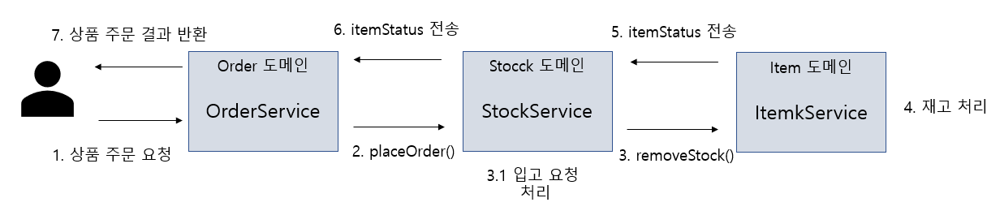
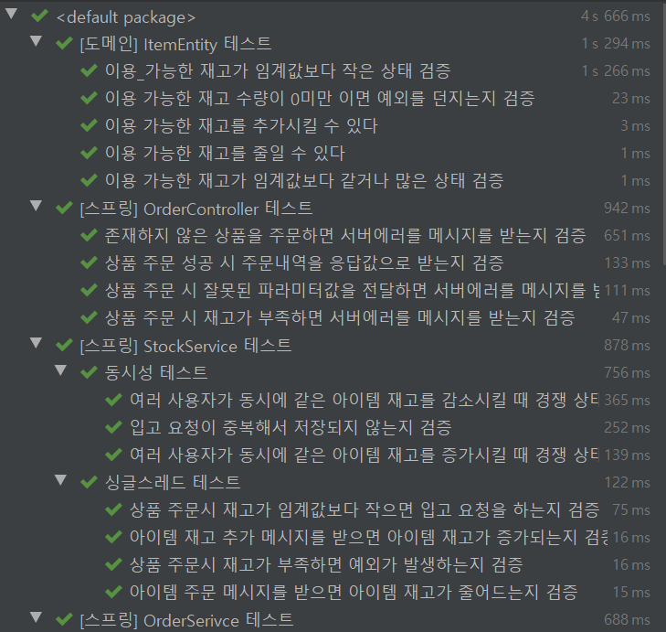

> 상품을 판매하는 쇼핑몰 서버를 마이크로서비스 형태로 분리하여 개발

## Getting Started

### Prerequisties

- Java 1.8
- Lombok plungins

### Run in development

```java
# build project
mvn package

# run project
java -jar target/service-0.0.1.jar
```

### Dependencies

|           Dependency           |    Version    |
| :----------------------------: | :-----------: |
|          spring-boot           |    2.4.6      |
|  spring-boot-starter-data-jpa  |               |
| spring-boot-starter-validation |               |
|    spring-boot-starter-web     |               |
|    spring-boot-starter-test    |               |
|       com.h2database:h2        |               |

---

## API Document
### 상품 주문 API
#### Request
```$xslt
POST /order
```
#### Request Fields
|Field|Type|Description|
|------|---|---|
|contactInfo.contactEmail|String|주문자의 이메일|
|contactInfo.contactName|String|주문자의 이름|
|contactInfo.mobile|String|주문자 연락처|
|items.itemType|ItemType|주문 상품의 타입|
|items.id|Number|주문 상품 id|

#### ItemType
|Type|String|Description|
|------|---|---|
|FOOD|food|음식|
|CLOTHES|clothes|의류|

#### Request Example
```$xslt
POST /order HTTP/1.1
Host: localhost:8080

{
    "contactInfo": {
        "contactEmail": "test@test.com",
        "contactName": "   구매자   ",
        "mobile": "01099999999    "
    },
    "items": {
        "itemType": "food",
        "id": 1
    }
}
```

#### Response Example
```$xslt
HTTP/1.1 200 OK
Content-Type: application/json

{
    "contactInfo": {
        "contactEmail": "test@test.com",
        "contactName": "구매자",
        "mobile": "01099999999"
    },
    "items": {
        "itemType": "food",
        "id": 1
    },
    "createDateTime": "2021-06-02T13:41:38.404"
}
```
#### Response Fields
|Field|Type|Description|
|------|---|---|
|contactInfo.contactEmail|String|주문자의 이메일|
|contactInfo.contactName|String|주문자의 이름|
|contactInfo.mobile|String|주문자 연락처|
|items.itemType|ItemType|주문 상품의 타입|
|items.id|Number|주문 상품 id|
|createDateTime|String|주문 완료 시각|

#### Error Response Example
```$xslt
HTTP/1.1 400 Bad Request
Content-Type: application/json
{
    "errorType": {
        "errorCode": -103,
        "message": "입력값이 잘못되었습니다."
    },
    "dispatcherPath": "/order",
    "details": "{itemId=0보다 커야 합니다, itemType=널이어서는 안됩니다, contactName=비어 있을 수 없습니다}"
}
```

#### Erorr Response Fields
|Field|Type|Description|
|------|---|---|
|errorType.errorCode|Number|에러타입의 코드|
|errorType.message|String|에러 메세지|
|dispatcherPath|String|실패한 요청 API Path|
|details|String|에러의 상세 내용|

#### ErrorCode
|Code|Description|
|------|---|
|-101|해당 아이템이 존재하지 않습니다.|
|-102|재고가 부족합니다.|
|-102|입력값이 잘못되었습니다.|

---

## Requirement

* 사용자는 상품 주문을 할 수 있다.
  * 주문자의 정보, 상품 정보를 입력하여 해당 상품을 주문할 수 있다.
  * 상품 주문 시, 해당 상품의 재고가 1개 줄어든다.
  * 상품 주문 결과를 사용자에게 응답해야 한다.
* 상품 재고가 임계값(10개)미만으로 떨어지게 될 경우 자동으로 입고 요청을 해야한다.
  * 입고 요청은 해당 상품의 정보와 벤더사와 주고 받을 암호화키를 포함한다.
  * 벤더사의 암호화 함수는 벤더사마다 다를 수 있다.
  
## Design Description

### Entity Design

#### Order Entity
|Attribute|Type|Description|
|------|---|---|
|id|Number|주문의 Id|
|contactEmail|String|주문자의 이메일|
|contactName|String|주문자의 이름|
|mobile|String|주문자 연락처|
|itemType|ItemType|주문 상품의 타입|
|id|Number|주문 상품 id|

#### Food, Clothes Entity
|Attribute|Type|Description|
|------|---|---|
|id|Number|입고 요청 Id|
|itemName|String|상품의 이름|
|availableStockQuantity|Number|이용 가능한 재고량|
|stockThreshold|Number|입고 요청 재고 임계값|
|requestStockQuantity|Number|입고 요청 시, 요청 재고량|
|Vendor|Vendor|상품의 벤더사|


#### ReceivingRequest Entity 
|Attribute|Type|Description|
|------|---|---|
|id|Number|입고 요청 Id|
|itemId|Number|입고 요청 상품의 Id|
|itemType|ItemType|입고 요청 상품의 Type|
|itemName|String|입고 요청 상품의 이름|
|requestStockQuantity|Number|입고 요청 재고량|
|encryptKey|String|벤더사 통신 암호화 key|
|createDateTime|String|입고 요청 시각|
  

### Design and Implement

* 마이크로서비스 전환을 고려한 설계
  * 요구사항을 주문(Order), 상품(Item), 재고(Stock) 도메인으로 분리
    * Item 도메인 : 상품 저장 및 관리를 담당
    * Stock 도메인 : 재고 관리, 입고 요청을 담당
    * Order 도메인 : 주문 정보를 발행
   
  * 도메인간의 의존성을 최소화하기 위해 서비스간 인터페이스를 통해 통신
  
  
  * 도메인 비지니스 로직을 프레임워크와 독립적으로 분리하여 재사용성 증가 및 테스팅 용이
  ```bash
  src
  ├── domain
  │   ├── common        // 서비스 간 통신 객체, ErroCode 등
  │   ├── exception     // Exception 패키지
  │   ├── item          // 상품 도메인 패키지
  │   └── order         // 주문 도메인 패키지
  │   └── stock         // 재고 도메인 패키지
  │       └── request   // 입고 요청 관련 패키지
  ├── springboot
      ├── common        // 에러 메시지 등 공통 패키지
      ├── item          
      ├── order         
      └── stock
  ``` 
  
 * 객체지향적인 설계
   * 객체 생성 및 조립과 같은 세부적인 구현은 스프링 DI/IcC에게 위임
   * 서비스간의 메시지 전달로 추상적인 처리
   * 상속, 추상클래스, 제네릭, 인터페이스 등의 특성을 적극 활용하여 확장성, 유연성 등을 높임
   ```java
   // 다양한 ItemType을 처리 할 수 있는 Repository Interface
   public interface IItemRepository<T extends ItemEntity> {
   
       public Optional<T> findById(Long id);
   
       public T save(T t);
   }
   ```
   
 * 협업을 고려한 구현
   * 주석, 문서화, 일관성 있는 코딩 컨벤션 등
   * 테스트 코드를 이용한 문서화 효과
   

  
  